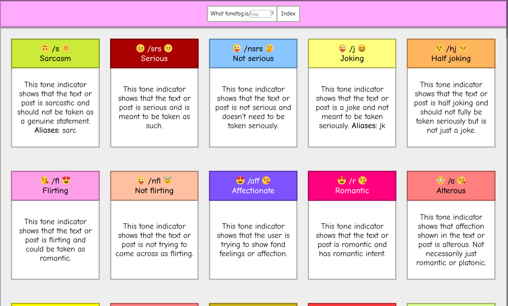

# Tonetag.is



[Tonetag.is](https://tonetag.is) is a website to look up the definitions of tone indicators, also known as tone tags.    

Tone indicators are used to convey tone in text-based communication. They are often used by neurodivergent people, such as people with autism or ADHD, to make their tone clear.  
An example of a tone indicator is /s, which means that the previous sentence was meant as sarcastic.

This website is built with [Quarkus](https://quarkus.io/), a Java framework. It is built with Kotlin. It is deployed with Terraform, Ansible and ArgoCD. You can see the deployments at [charts](https://github.com/tonetag/charts) and [deployment](https://github.com/tonetag/deployment).  

## Contributing
Tone indicators are a relatively new concept, and my list may not be complete. Tone indicators are stored in a JSON file, which can be found in `src/main/resources/META-INF/data/tags`.  

If you want to add a tone indicator, please make a pull request! Please make sure that the tone indicator is not already in the list and that is actually used by people.  

## Running the application in dev mode

You can run the application in dev mode that enables live coding using:
```shell script
./gradlew quarkusDev
```

## Packaging and running the application

The application can be packaged using:
```shell script
./gradlew build
```
It produces the `quarkus-run.jar` file in the `build/quarkus-app/` directory.
Be aware that it’s not an _über-jar_ as the dependencies are copied into the `build/quarkus-app/lib/` directory.

## Creating a Docker image

You can create a Docker image using:
```shell script
quarkus build -Dquarkus.container-image.build=true
```

This will create a container image with the name `ghcr.io/tonetag/tonetag` and tag of the version of the application.  

A container of the current version is also published at the [GitHub Container Registry](ghcr.io/tonetag/tonetag).  

## Deployment
Deployment is done in the [tonetag/deployment](https://github.com/tonetag/deployment) repository. Please check there for more information!  